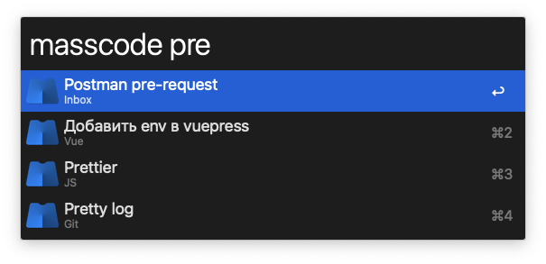

# massCode Assistant for Alfred

Fetch snippets from [massCode](https://github.com/massCodeIO/massCode), search and copy to clipboard.

## Install to Alfred

[Download](https://github.com/massCodeIO/assistant-alfred/blob/master/dist/massCode%20assistant.alfredworkflow) and click to install.
